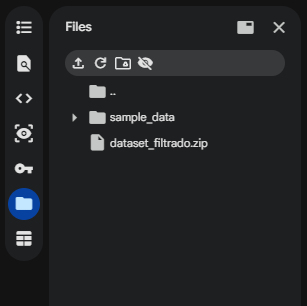

# early-blight-tomato-detection
Detección de enfermedades en hojas de tomate mediante procesamiento digital de imágenes. El proyecto analiza síntomas del tizón temprano (Early Blight) usando técnicas como filtrado, segmentación, transformación a HSV y operaciones morfológicas, con el objetivo de lograr una identificación temprana, objetiva y eficiente.

# Información

Este proyecto implementa un sistema basado en procesamiento digital de imágenes para detectar el tizón temprano en hojas de tomate, identificando regiones afectadas mediante segmentación y análisis de características como color y área afectada.

El proyecto utiliza dos datasets:

- **Tomato_Dataset.zip**: dataset original con aproximadamente 2000 imágenes de hojas de tomate, incluyendo hojas sanas y con enfermedad.
- **dataset_filtrado.zip**: dataset reducido que contiene una muestra de 6 imágenes (3 hojas sanas y 3 enfermas), utilizado para el desarrollo y pruebas del algoritmo.

Dataset original:
https://data.mendeley.com/datasets/tywbtsjrjv/1

Clases utilizadas:
- Tomato Early Blight
- Tomato Healthy

Para este proyecto se trabaja únicamente con el dataset **dataset_filtrado**, con el fin de aplicar la metodología sobre una muestra pequeña, controlada y fácil de analizar. El dataset completo **Tomato_Dataset.zip** no se utiliza en esta implementación.

# ⚠️ Importante

Este algoritmo solo funciona en Google Colab.

# Instrucciones Implementacion

1. Descargar el archivo .zip del repositorio  
2. Entrar a la carpeta `datasets` y descargar el archivo `.zip` llamado `dataset_filtrado`  
3. Descargar el archivo `.ipynb` llamado `Avances_Proyecto_Tomato_EARLY_BLIGHT`  
4. Entrar a Google Colab  
5. Subir un notebook → importar el archivo `.ipynb`  
6. Subir el dataset en la sección **Files** de Colab directamente (como se indica en la figura)  

# Uso

Una vez completados los pasos anteriores, ejecutar el notebook para visualizar los avances del proyecto y analizar la detección del tizón temprano en hojas de tomate.